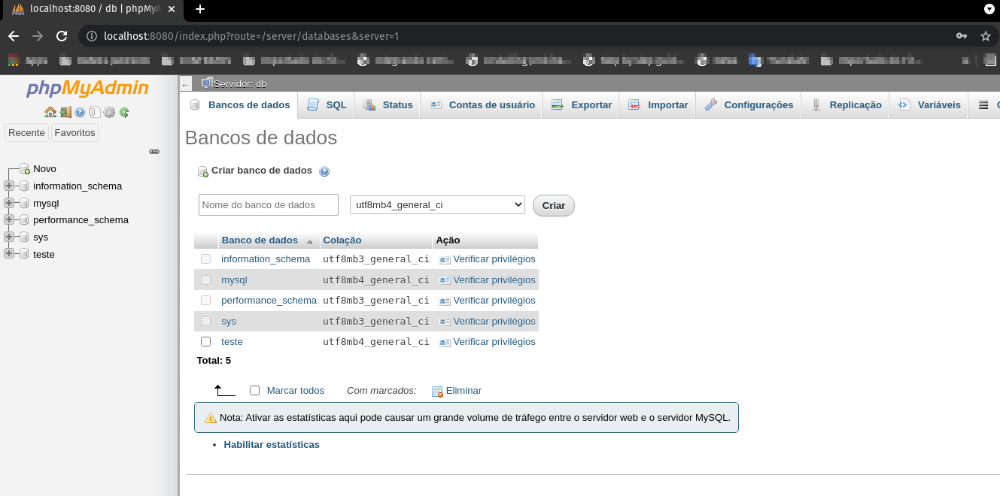

# Rodando mariaDB com phpmyadmin em Docker

### Criando o volume
```
docker volume create mariadb_vol
```
### Criando a rede
```
docker network create NetMariaDB
```
### Subindo o Container de Banco
```
docker container run -p 127.0.0.1:3306:3306 \
-v "mariadb_vol:/dados" \
--name mariaDB -e MARIADB_ROOT_PASSWORD=senha123 \
--network NetMariaDB -d mariadb:10.6.4
```
### Subindo o Container do PHPAdmin na porta 8080
```
docker container run --name phpadmin -d --link mariaDB:db -p 8080:80 -e MYSQL_PASSWORD=senha123 --network NetMariaDB phpmyadmin
```
### php MyAdmin
